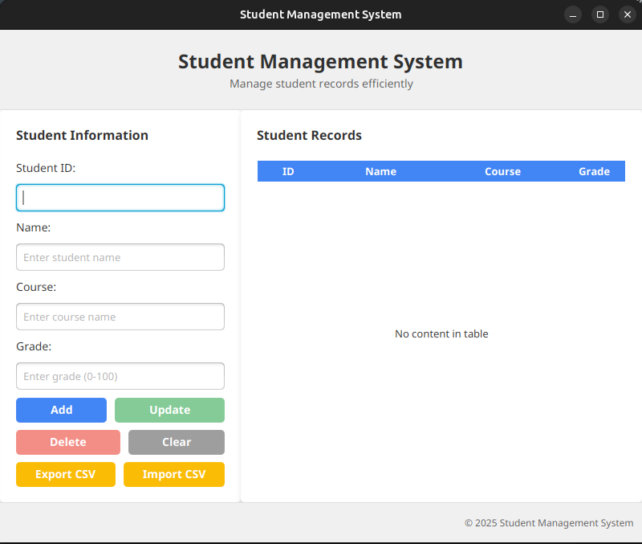

# Student Management System

A simple, yet functional Student Management System built with Java and JavaFX, using SQLite as the database engine.

## Features

- **Student Registration**: Add, update, and delete student records
- **Database Storage**: Data is stored in a SQLite database
- **File Handling**: Import and export student data to/from CSV files
- **Multithreading**: Background processing for file operations
- **Exception Handling**: Comprehensive error handling
- **User-Friendly Interface**: Clean and responsive JavaFX UI

## Screenshots

[Screenshots would be included here after the application is built]


## Requirements

- Java Development Kit (JDK) 17 or higher
- JavaFX SDK 17 or higher
- SQLite JDBC Driver

## Setup and Installation

1. Clone the repository or download the source code.
2. Set up the project in your preferred IDE (IntelliJ IDEA, Eclipse, etc.).
3. Make sure to include the required dependencies:
    - JavaFX SDK
    - SQLite JDBC Driver

### Using Maven

The required dependencies are already specified in the `pom.xml` file.

## Running the Application

### From an IDE

1. Open the project in your IDE.
2. Make sure the dependencies are properly set up.
3. Run the `StudentsManagedApp` class.

### Using Maven

```
mvn javafx:run
```

## Usage Guide

### Managing Students

1. **Add a Student**:
    - Fill in the student details (ID, Name, Course, Grade).
    - Click the "Add" button.

2. **Update a Student**:
    - Select a student from the table.
    - Modify the details in the form.
    - Click the "Update" button.

3. **Delete a Student**:
    - Select a student from the table.
    - Click the "Delete" button.

4. **Clear the Form**:
    - Click the "Clear" button to reset the form fields.

### Importing and Exporting Data

1. **Export to CSV**:
    - Click the "Export CSV" button.
    - Choose a location to save the file.
    - All student records will be exported to the CSV file.

2. **Import from CSV**:
    - Click the "Import CSV" button.
    - Select a CSV file to import.
    - The records will be imported into the system.

## Project Structure

The project follows a standard package structure:

- `com.sms`: Root package
- `com.sms.controller`: UI controllers
- `com.sms.db`: Database-related classes
- `com.sms.exception`: Custom exception classes
- `com.sms.model`: Data model classes
- `com.sms.service`: Business logic services
- `com.sms.util`: Utility classes

## Database Schema

The application uses a simple SQLite database with a single table:

```sql
CREATE TABLE students (
    id TEXT PRIMARY KEY,
    name TEXT NOT NULL,
    course TEXT NOT NULL,
    grade REAL NOT NULL
);
```

## OOP Principles Implementation

- **Encapsulation**: Private fields with getters and setters
- **Abstraction**: Separating the UI from the business logic
- **Single Responsibility**: Each class has a specific responsibility
- **Separation of Concerns**: Controller, Model, Service, DAO pattern

## Future Enhancements

- Add user authentication
- Implement more advanced search and filtering
- Add course management functionality
- Integrate with cloud storage
- Add data visualization for grades

## Acknowledgments

- JavaFX community
- SQLite
- AI of course